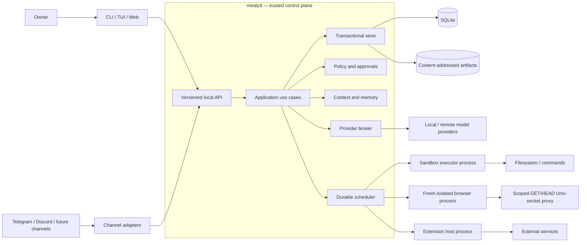
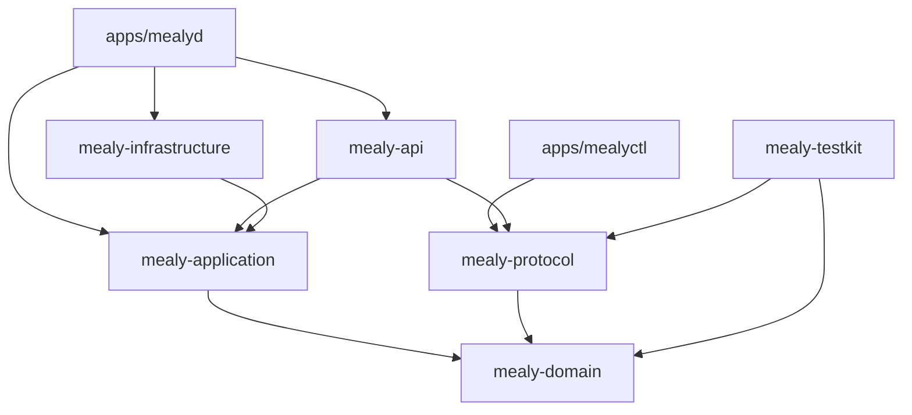
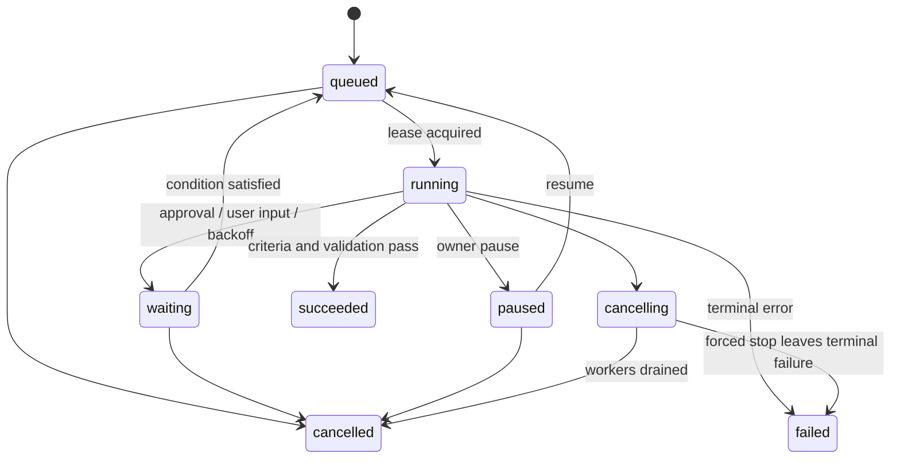
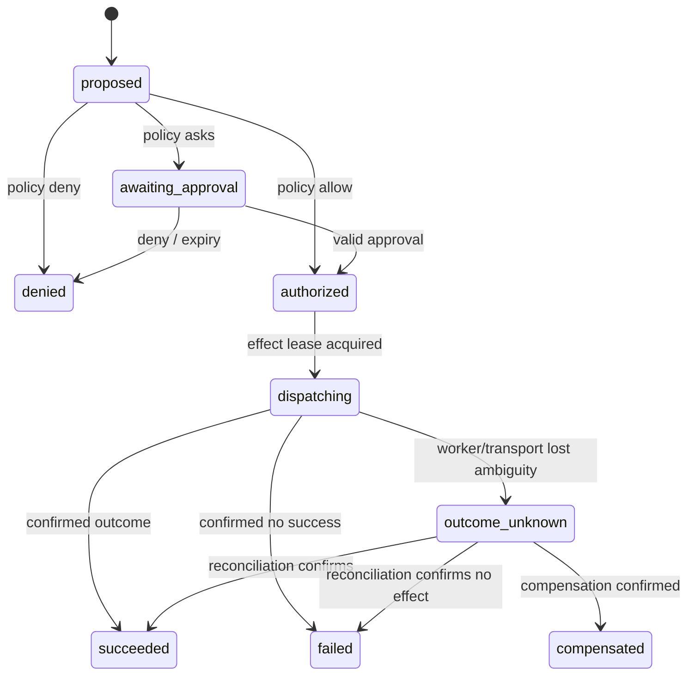
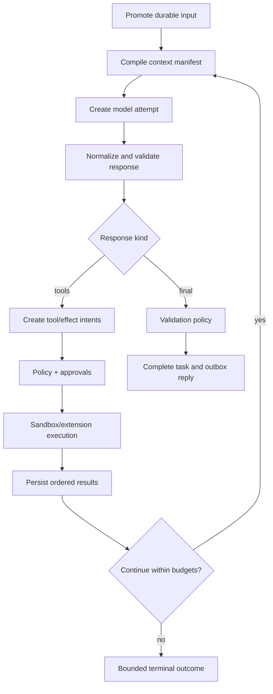

# Mealy Architecture

- Version: 0.1.0
- Status: implemented release-one baseline; competitive capability work in progress
- Requirements: [`REQUIREMENTS.md`](REQUIREMENTS.md)
- Research: [`docs/research/REFERENCE_SYSTEMS.md`](docs/research/REFERENCE_SYSTEMS.md)

## 1. Executive design

Mealy is a **modular monolith with isolated workers**:

- one Rust daemon, `mealyd`, is the trusted control plane and composition root;
- one SQLite database is the transactional authority for canonical state, transition history, leases, inboxes, and outboxes;
- immutable large content lives in a content-addressed artifact store;
- agent reasoning orchestration lives in application modules, not in channels or providers;
- shell, filesystem mutation, browser control, and third-party extensions execute outside the daemon process;
- local clients and channel adapters use one versioned command/query/event API;
- recovery resumes from explicit durable boundaries and never guesses that an unknown effect failed.

This is deliberately not microservices, not pure event sourcing, and not an in-process plugin platform. The architecture keeps the first personal-daemon release operable while preserving the boundaries that are expensive to retrofit later.

## 2. What the references changed

The previous architecture had several sound instincts—daemon ownership, thin channels, SQLite, explicit policy, context manifests, independent validation—but its append-only event ledger was asked to be the answer to too many problems. The reference systems sharpened the design:

| Evidence | Adopted decision |
|---|---|
| Codex uses explicit thread/turn/item primitives, generated protocol schemas, bounded server queues, platform sandboxes, and fresh Guardian review sessions. | Use explicit domain IDs, versioned DTOs, bounded ingress, OS enforcement, and isolated risk-based validation. |
| OpenClaw has a successful single gateway and channel model, but its events are not replayed, queues are in-process, plugins are trusted in-process, and sandboxing is off by default. | Keep one daemon and thin channels; move input queues to SQLite, make events resumable, isolate extensions, and make restricted execution the normal path. |
| Hermes centralizes providers/tools and uses SQLite/FTS, but large orchestration modules and JSON mirrors create coupling and recovery complexity; its security policy correctly distinguishes OS boundaries from heuristics. | Use coarse architectural modules, one canonical store, small ports, and explicit OS boundaries. Avoid mirror files as a second authority. |
| OpenCode's Effect services, durable aggregate sequencing, context epochs, input promotion, and atomic projectors are strong; its ongoing dual-write/event migration demonstrates the cost of pure event sourcing. | Adopt aggregate sequences, context epochs, and atomic state+journal commits, but keep normalized canonical tables rather than requiring full reconstruction from all historical events. |
| Vercel AI SDK cleanly separates UI/model/provider messages, validates tools, bounds loops, and re-validates approvals; it intentionally leaves durability and memory ownership to applications. | Use message layers and schema validation at adapters; Mealy supplies the missing durable host semantics. |
| Eve proves durable step checkpoints and parked approvals, but interrupted steps re-run, message FIFO is delegated to channels, and durability depends on a workflow world. | Checkpoint at safe boundaries, persist parked work, own the FIFO in core, and implement scheduling locally. |
| Pi's small agent core and JSONL session tree are understandable; its durability design correctly refuses unsafe tool replay, but the fully durable harness remains a design rather than implemented recovery. | Keep the loop small, make recovery semantics part of tool contracts, and test them before calling the runtime durable. |
| The Claude Code mirror shows strong transcript-before-execution persistence, queued writes, explicit tool risk metadata, coordinator/worker isolation, and fresh verification. It is an unlicensed third-party mirror of proprietary source. | Use only independently described architectural lessons; do not copy code, identifiers, or implementation text from that mirror. |

Detailed evidence and commit pins are in the research report.

## 3. Architectural invariants

1. A channel acknowledgement follows, never precedes, the durable inbox commit.
2. Only application use cases may transition canonical task/run/effect state.
3. Each accepted transition writes canonical state, a journal event, and outbox entries in one SQLite transaction.
4. Journal events are immutable history; canonical tables are the efficient current-state authority. Neither is an eventually consistent shadow of the other.
5. Every worker commit is fenced by the current lease token.
6. A model is an untrusted decision proposer. A policy decision is made by deterministic code.
7. The daemon never runs model-proposed shell or arbitrary extension code in its own process.
8. An approval binds an exact effect intent; it is invalid if the intent changes.
9. Unknown non-idempotent effects stop for reconciliation.
10. Context and compaction are derived, inspectable records; source history remains canonical.
11. Third-party extension manifests are readable without loading their code.
12. Debug replay consumes recorded results and cannot produce external effects.

## 4. System context



### 4.1 Runtime trust zones

| Zone | Contents | Secret access | Arbitrary code | Failure effect |
|---|---|---:|---:|---|
| Trusted control plane | daemon, store, policy, provider broker, secret broker | scoped broker access | first-party compiled code only | daemon restart and recovery |
| Restricted executor | file/process worker under OS policy | invocation-scoped handles only | model-proposed commands | kill worker; classify active effect |
| Browser sandbox | one content-pinned Headless Shell plus trusted worker per read | none | rendered page/browser runtime | terminate call and delete profile; durable daemon survives |
| Extension host | one or more third-party extension processes | declared scoped handles only | installed extension code | disable affected extension; daemon remains healthy |
| MCP stdio sandbox | one owner-selected native server per fresh session | none in the initial profile | digest-pinned server code | reject call/startup; durable tasks and daemon survive |
| External | model providers, APIs, channels | credentials sent only by broker | outside Mealy | retry, reconcile, or degrade by policy |

The initial implementation may use trusted built-in channel and provider adapters in the daemon. No third-party code is promoted into that zone.

## 5. Code architecture

The dependency direction is coarse on purpose. Too many crates would turn a personal daemon into a distributed system made of Cargo packages.



### 5.1 Crate responsibilities

#### `mealy-domain`

Pure domain types and state machines. It has no database, network, OS, async runtime, provider SDK, or web framework dependencies.

- typed IDs and time/value objects;
- session, task, run, attempt, approval, effect, memory, and validation states;
- transition validation and invariant errors;
- capability, risk, and effect classifications;
- version-neutral event facts used by the application layer.

#### `mealy-application`

Use cases and ports. It coordinates transactions but does not know SQLite or HTTP details.

- command handlers and query handlers;
- durable scheduler, leases, and recovery classifier;
- agent loop and delegation;
- policy orchestration and approval binding;
- context compilation and memory lifecycle;
- validation orchestration;
- port traits for transactions, providers, executors, artifacts, secrets, clocks, IDs, and extension hosts.

Application modules are internal boundaries, not separate services:

```text
identity  sessions  tasks  scheduler  agents  providers
tools     policy    context memory     validation channels
```

Cross-module writes occur through use cases, never by reaching into another module's repository tables.

#### `mealy-infrastructure`

Concrete adapters.

- SQLite repositories, transactions, migrations, lease claims, and outbox;
- filesystem content-addressed artifacts;
- process supervisor and sandbox backends;
- built-in provider clients;
- OS keyring/secret broker;
- extension RPC host client;
- telemetry exporters and system service integration.

#### `mealy-protocol`

Stable transport-facing DTOs and event envelopes. Domain types are not serialized directly. This permits protocol compatibility to evolve separately from internal refactoring.

#### `mealy-api`

Authentication, authorization entry, bounded request handling, command/query routes, timeline streaming, health, readiness, and OpenAPI generation.

#### Applications

- `mealyd`: composition root, config, lifecycle, supervision, recovery, API listener.
- `mealyctl`: local administrative and scripting client. The first interactive surface.

#### `mealy-testkit`

Deterministic clock and ID generators, fake providers, fake executors, crash injection, scenario driver, and fixture builders. Production crates must not depend on it.

## 6. Domain model

### 6.1 Ownership hierarchy

```text
Principal
└── Session (ordered durable inbox)
    ├── Turn (one promoted input)
    │   └── Task (user-visible objective; may outlive a turn)
    │       ├── Run (one agent role)
    │       │   ├── Attempt (model/tool/validation attempt)
    │       │   └── Child Run edges
    │       ├── Effect Intent → Approval → Effect Outcome
    │       ├── Context Manifests
    │       ├── Artifact References
    │       └── Validation Runs
    └── Inbox entries not yet promoted
```

A task may be created from a turn or by a schedule. A session is conversational ordering, not an authorization boundary. A run is execution lineage, not a user-visible chat thread.

### 6.2 Task state machine



State changes carry a monotonic `revision`. Commands use expected revisions where races matter.

### 6.3 Run and attempt distinction

A run represents the logical execution by one agent role. Attempts represent retryable operations. Retrying a provider call creates a new attempt under the same run. Restarting a failed implementation from a clean context may create a new sibling run. This makes cost, failure, and validation lineage explicit rather than overwriting one status row.

### 6.4 Effect state machine



`outcome_unknown` is a first-class safety state. The scheduler never turns it into `authorized` by timeout alone.

## 7. Persistence architecture

### 7.1 Why transactional journaling, not pure event sourcing

Mealy needs history, resumable streams, causation, and forensic replay. It does not need every future version to rebuild all state from every event schema ever emitted. The store therefore has two co-authoritative products committed together:

1. normalized canonical tables for current state and scheduling;
2. an immutable transition journal for history, streaming, audit, and debug simulation.

Derived read models may be rebuilt. Canonical state is changed by migrations, not reconstructed by replaying unbounded historical business logic. This avoids both the dual-source problem seen in mirror-file designs and the migration burden exposed by a pure event transition.

### 7.2 Transaction pattern

Every mutating use case follows one shape:

```text
BEGIN IMMEDIATE
  authenticate/authorize preconditions already resolved
  load canonical rows and verify expected revisions/fencing token
  apply domain transition
  write canonical rows
  append versioned journal event with aggregate sequence
  append zero or more outbox records
COMMIT
publish in-process wakeup hint
```

The wakeup is only a latency optimization. Polling the database is sufficient after a missed notification or restart.

Runtime connection ownership is explicit. `mealyd` has one canonical writer connection and a
bounded pool of read-only, query-only connections. Every compound query borrows one reader, begins
a deferred WAL snapshot, and releases it at the use-case boundary; it cannot block the writer lane
by holding the same process mutex. Mutations remain serialized through the writer and retain the
transaction shape above. Provider, tool, browser, channel, and extension I/O never holds either
lane. Reader-pool exhaustion applies bounded backpressure, while cancellation probes use a
non-blocking reader attempt and do not interpret contention as cancellation. See
[`ADR 0009`](docs/decisions/0009-sqlite-writer-and-snapshot-readers.md).

### 7.3 Core tables

The initial schema is organized by responsibility:

| Area | Canonical tables |
|---|---|
| Identity | `principals`, `channel_bindings`, `auth_credentials`, `revocations` |
| Conversation | `sessions`, `session_inbox`, `turns`, `messages` |
| Work | `tasks`, `runs`, `run_edges`, `attempts`, `work_leases`, `resource_claims` |
| Effects | `tool_calls`, `effect_intents`, `approvals`, `effect_outcomes` |
| Context | `context_epoch`, `context_manifest`, schema-16 `context_manifest_bundle`, sparse bundle provenance, legacy `context_manifest_item`, compactions |
| Memory | `memories`, `memory_sources`, `memory_revisions`, FTS tables |
| Evidence | `artifacts`, `artifact_links`, `validations`, `validation_evidence` |
| Operations | `journal_events`, `aggregate_sequences`, `outbox`, `config_versions`, `migration_history` |

Foreign keys are enabled. SQLite uses WAL mode, a busy timeout, and explicit durability settings selected by profile. Schema constraints enforce unique aggregate sequence, inbox dedupe keys, active lease ownership, and stable effect idempotency keys.

Every new schema-16 context manifest persists its complete ordered items as one bounded canonical
JSON object. The digest is over the uncompressed canonical bytes; storage may use the same bounded
zlib/base64url envelope as other large durable JSON. Summary counts are independently recomputed
on read, and sparse foreign-key rows retain artifact ownership, compaction identity, and governed
memory citations. Legacy row-per-item manifests are not rewritten during migration and remain
fully replayable. This append-forward representation removes complete-prefix row/index fan-out
from the writer's critical transaction without weakening inspectability.

### 7.4 Journal envelope

```text
event_id             UUIDv7
aggregate_kind       session | task | run | effect | memory | ...
aggregate_id         stable domain ID
aggregate_sequence   contiguous per aggregate
event_type           namespaced semantic type
event_version        positive integer
occurred_at           UTC timestamp from the transaction clock
actor_principal_id   nullable only for system recovery events
correlation_id       task or request lineage
causation_id         command/event that caused this event
policy_version       when security-relevant
sensitivity          classification
payload              bounded JSON
```

Payloads are small. Large request/response bodies, logs, patches, and media become artifacts.

### 7.5 Artifact commit protocol

1. Stream bytes to a private temporary file while hashing and enforcing size.
2. Flush and atomically rename to `artifacts/<algorithm>/<digest>`.
3. In a database transaction, insert metadata and link it to the owning object.
4. A garbage collector removes unreferenced, aged content; it never removes referenced content.

Content encryption at rest is an adapter concern, but the digest is over the plaintext logical content and sensitive metadata is access-controlled.

## 8. Durable inbox, scheduler, and recovery

### 8.1 Input admission

Each adapter derives a stable delivery dedupe key from the channel event ID. Admission inserts the inbox row, journal event, and acknowledgement outbox record atomically. Duplicate delivery returns the original admission result.

The session driver promotes inbox records according to one of three explicit modes:

- `queue`: FIFO, one turn after the current turn;
- `steer_at_boundary`: attach to the current run at the next model/tool boundary without cancelling an active effect;
- `interrupt_then_queue`: request cancellation, then promote after the active run reaches a terminal or forced-stop boundary.

No accepted message lives only in RAM.

### 8.2 Lease claim

A worker claims work with `(lease_id, owner_id, fencing_token, expires_at)`. Renewals update only the matching lease. Every result commit verifies the fencing token against the canonical row. An expired worker may continue computing, but it cannot alter Mealy after another worker claims the work.

### 8.3 Resource claims

Tools and agents declare normalized conflict keys, for example:

```text
workspace-write:C:/repo
service-mutate:github:owner/repo
memory-write:principal/project
device-exclusive:browser-profile/default
```

The scheduler obtains claims in lexical order to avoid deadlock. Read claims may share; write/exclusive claims may not. Policy may require stricter serialization than the tool declares.

### 8.4 Startup recovery

Recovery runs before readiness:

1. Open SQLite and validate migration state.
2. Verify artifact root and quarantine incomplete temporary files.
3. Expire stale leases and increment fencing tokens.
4. Classify non-terminal attempts and effects.
5. Requeue safe model attempts and pure/idempotent operations.
6. Mark ambiguous non-idempotent effects `outcome_unknown`.
7. Restore waiting approvals and user-input requests.
8. Resume durable outbox delivery.
9. Publish a recovery summary and become ready.

Classification is deterministic code covered by table-driven tests. It is not delegated to a model.

### 8.5 Recovery matrix

| Interrupted boundary | Default recovery |
|---|---|
| Before provider request dispatch | retry attempt |
| Provider request sent, no normalized response recorded | retry only under provider/cost policy; preserve prior attempt |
| Normalized model response recorded | continue from recorded response |
| Pure/read-only tool not confirmed | bounded retry |
| Idempotent effect with stable downstream key | retry with same key |
| Non-idempotent effect after dispatch | `outcome_unknown`; reconcile |
| Approval waiting | restore waiting state |
| Compaction not committed | recompute derived artifact |
| Artifact committed but link transaction missing | GC later unless reconciliation links it |
| Outbox delivery unknown | retry using delivery dedupe key |

## 9. Agent runtime

### 9.1 Loop



The loop is an application state machine. Provider SDK callbacks and UI streams adapt into it; they do not own it.

### 9.2 Message layers

Following the successful separation in Vercel AI SDK and Codex:

1. **Domain message**: provider-neutral, durable user/assistant/tool/event facts.
2. **Context item**: authorized, transformed material selected for one attempt.
3. **Provider message**: normalized provider contract.
4. **Wire payload**: provider-specific request/stream type.
5. **Presentation event**: channel-safe timeline representation.

Conversions are one-way at explicit adapters. Raw provider payloads may be retained as sensitive artifacts for debugging but never become the domain model.

### 9.3 Model attempts

Each request records provider/model, normalized parameter set, context manifest ID, tool schema digests, policy/routing decision, timeout, and budget reservation before dispatch. Completion records usage, finish reason, response artifact, normalized result, and provider request ID.

Streaming deltas are best-effort presentation data. The terminal normalized response is the durable boundary.

### 9.4 Delegation

Delegation creates a child run with:

- a self-contained work order and success criteria;
- explicit parent/root lineage;
- a new context manifest and fresh context window;
- an independently computed capability intersection;
- separate budgets and resource claims;
- a structured result contract.

The parent remains responsible for synthesis. It cannot claim child output as validated merely because the child completed.

## 10. Tools, policy, and execution

### 10.1 Tool descriptor

Every tool publishes metadata before it can be selected:

```text
id, version, input_schema, output_schema
effect_class, risk_class, required_capabilities
timeout, maximum_output, concurrency_mode
conflict_key_template
idempotency: pure | idempotent | keyed | non_idempotent
recovery: retry | reconcile | compensate | never_retry
executor: builtin | sandbox | extension:<id> | provider
```

The schema digest is included in the context manifest and effect intent.

### 10.2 Policy decision

The policy engine receives a typed request, not an arbitrary shell string alone:

```text
principal + channel binding
task/run/agent role and risk
tool descriptor and normalized arguments
target capability and resource claims
workspace roots and sandbox profile
secret references and network destinations
current policy bundle version
```

It returns `deny`, `allow`, or `require_approval`, plus obligations such as a narrower sandbox, argument rewrite, redaction, maximum duration, or validator requirement.

Policy rules are deterministic data interpreted by first-party code in v1. A policy language may be added later, but it must not make authorization depend on an LLM.

### 10.3 Approval binding

The approval subject hash covers:

```text
effect_id | tool_id@version | canonical_arguments_digest
capability_scope | target_resources | policy_version | expiry
```

Approval replies are authenticated commands. They never arrive as untrusted conversational text. Channels may render native buttons, but those buttons call the same approval API.

### 10.4 Executor protocol

The daemon launches a worker with a one-use capability token and a descriptor containing:

- effect and attempt IDs;
- fencing token;
- executable/tool identity digest;
- sandbox profile and mounted roots;
- resource/time/output limits;
- scoped secret handles;
- idempotency key;
- normalized arguments.

The worker emits structured start, progress, and terminal frames. Loss of the worker after dispatch is interpreted according to the tool recovery descriptor, not assumed failure.

### 10.5 Platform sandbox adapters

- Linux: prefer namespaces/bubblewrap or an equivalent backend with explicit filesystem and network policy.
- macOS: use Seatbelt or a container/VM adapter with documented limits.

Windows is outside the release-one support and CI contract. A future Windows port requires a
separately reviewed restricted-token/AppContainer/job-object or VM/container adapter; no current
release claim depends on that design.

The architecture exposes capability semantics, not one platform's flags. `doctor` reports which profiles the current host can enforce.

### 10.6 Production workspace mutation subset

Linux production mutation authority is explicit and narrow. A stopped-daemon writable-workspace
grant enables create-new, existing-file replacement, and path-lifecycle descriptors, but only
`/act`, `/edit`, or `/manage` admission places one of them in a run ceiling.
All workspace roots are canonically disjoint from the daemon home: neither state descendants nor
roots containing the state directory can become model or worker authority. The stopped-home CLI
and daemon startup enforce that invariant independently. The generated systemd unit derives exact
`ReadWritePaths` entries from the validated writable subset, in addition to the daemon home, so its
outer `ProtectHome=read-only`/`ProtectSystem=strict` boundary matches the inner tool policy.
Generation rejects homes or workspaces hidden by `PrivateTmp=true` and rejects volatile
`tmpfs`/`ramfs` state homes. Its private umask applies to the daemon and children; the intentional
status-2 forced-drain exit is restart-inhibited so service supervision cannot reopen admission.
The outer unit additionally isolates devices and kernel/control-plane interfaces, constrains
process visibility, socket families, and syscall ABI, and denies realtime scheduling without
blocking the nested hostname/proc operations, secure `openat2(O_CREAT)` path, V8 JIT, or outbound
HTTPS required by explicit capabilities. `NoNewPrivileges`, the private umask, Bubblewrap
capability dropping, read-only outer views, and request-specific mounts provide the applicable
privilege and filesystem boundaries.
`workspace.replace_file` binds the logical target,
current SHA-256, and exactly one of complete content or an ordered list of at most 16 exact
old/new-text edits with expected non-overlapping occurrence counts. The sandbox worker reopens the
target beneath the selected root without following symlinks or crossing mounts, verifies all
preconditions, derives bounded UTF-8 output, and commits through a private mode-`0600` staging file,
file/directory synchronization, and atomic rename. Any mismatch occurs before rename and leaves the
original intact.

`workspace.manage_path` accepts exactly one of create-directory, move-file, remove-file, or
remove-empty-directory. It creates no missing parent, never overwrites or recurses, and binds every
logical target plus a complete-content SHA-256 for a file move/removal. The worker resolves safe
parents with `openat2` beneath/no-symlink/no-magic-link/no-mount-crossing flags. Moves use
`renameat2(RENAME_NOREPLACE)`, synchronize both parents, and recheck the destination digest.
Removal first moves the target exclusively into an effect/attempt-specific root quarantine,
synchronizes it, rechecks the digest, then unlinks and synchronizes again. Empty-directory removal
uses non-recursive `unlinkat(AT_REMOVEDIR)`. The descriptor is conservatively non-idempotent with
reconcile-only recovery, so an interrupted post-dispatch attempt is parked rather than retried.
Recursive tree operations, directory moves, overwrite, fuzzy patching, and chmod are not implied by
these descriptors.

`process.run` additionally restricts each configured command to one canonical root-controlled ELF
file and its stopped-daemon SHA-256 grant. The trusted daemon discovers the worker/command dynamic
runtime only through the exact root-controlled `/usr/bin/ldd`, with an empty environment and `--`
before the canonical path; it never searches the owner's `PATH` or carries `LD_*` state into that
inspection. Missing or untrusted inspection support omits the action tool rather than weakening
the sandbox. Model dispatch remains a direct `execve`-style argument vector inside Bubblewrap, not
a shell command.

## 11. Context and memory

### 11.1 Context compiler

The compiler is a deterministic pipeline:

```text
candidate discovery
→ authorization and namespace filtering
→ sensitivity/provider-residency filtering
→ relevance and recency scoring
→ typed mandatory-item insertion
→ budget allocation
→ compaction/truncation transforms
→ ordered context manifest
→ provider message projection
```

Mandatory typed items include active goal, unresolved constraints, current effect/approval state, latest user input, agent profile, and policy obligations. These are not left to semantic retrieval.

### 11.2 Context epochs

A session context epoch pins the baseline instructions, agent profile, workspace identity, and relevant configuration digest. Changes reconcile into a new epoch at a turn boundary. An in-flight request never observes half of a configuration change, following the context-snapshot lesson from OpenCode and prompt-stability lesson from Hermes.

### 11.3 Compaction

Compaction creates:

- a structured carry-forward record for decisions, constraints, unresolved work, effect outcomes, and citations;
- a human-readable summary;
- a source event range and content digests;
- prompt/model/config provenance;
- a quality/validation result when required.

The original history remains available. Subsequent contexts cite the compaction artifact and can expand selected source evidence.

### 11.4 Memory model

Memory is not the transcript. A memory proposal is extracted from cited source items, filtered by policy, and promoted to active state by configured rules. Versioned correction supersedes rather than silently edits history.

V1 uses SQLite structured filters and FTS5. Embeddings are an optional adapter added only after lexical/provenance behavior is correct. This keeps degraded mode useful and avoids making a vector index authoritative.

## 12. Providers

Provider ports describe capabilities rather than forcing all vendors into the lowest common denominator. The common contract covers model listing, normalized request/response, streaming, tool calling, structured output, usage, cancellation, and error classification. Namespaced capability metadata preserves vendor features without infecting the core.

Routing is a policy decision with an explanation. Fallback creates a new attempt and re-runs context residency checks. A local-to-remote fallback is never implicit.

The provider broker owns credentials, rate limits, concurrency, and cost reservations. Agent workers and extension hosts receive no ambient provider API keys.

An optional owner-local subscription adapter may delegate authentication and transport to an
already signed-in official Codex or Claude client. It is not a core dependency and does not turn a
personal subscription into an API credential. Configuration pins the canonical executable and
SHA-256; every invocation rechecks that identity, clears API-key variables, disables host-client
tools/connectors/persistence, and accepts only bounded structured decision and usage output. The
official client remains trusted code with access to its own authentication home, while its model
decision remains untrusted provider output. The direct Responses/Messages adapters and deterministic
fixture remain independently implemented, preserving the requirement that Mealy not depend on
another agent product for core behavior.

## 13. Extension architecture

### 13.1 Manifest plane

Discovery reads a data-only manifest containing identity, digest/signature, compatibility, capability contracts, schemas, requested permissions, network destinations, secret references, migrations, and health behavior. Configuration UIs and policy review can operate without importing extension code.

### 13.2 Runtime plane

Third-party extensions execute in a supervised process. The daemon speaks a versioned framed RPC protocol over local IPC. The host:

- grants only manifest-approved capabilities;
- sends opaque secret handles or brokered requests, not the full environment;
- validates every request and response schema;
- applies time, memory, output, and restart limits;
- attributes all actions to the extension identity;
- can revoke or kill the extension without stopping the daemon.

An extension cannot open arbitrary daemon HTTP routes. It may register a channel endpoint descriptor that the trusted API layer serves after applying route authentication and bounds.

### 13.3 Extension types

- provider adapter;
- channel adapter;
- tool service;
- memory source;
- artifact renderer;
- notification sink.

Skills remain declarative resources. If a skill ships code, that code is a declared extension/tool and gets a separate permission review.

### 13.4 MCP adapter subset

MCP is an adapter protocol, never an authority source. The initial implementation accepts only
native local stdio servers negotiating exact revision `2025-11-25`. Owner inspection and activation
bind executable bytes, direct non-secret arguments, the complete paginated tool set, and every
selected full definition and self-contained schema. A model sees only selected namespaced
read-only descriptors. Server annotations do not alter effect class, policy, or sandbox grants.

Startup and every call use a fresh process and repeat initialization plus full discovery before
dispatch. Linux Bubblewrap provides an empty environment and namespaces with no network, home,
workspace, secrets, persistent writable mount, shell, `PATH`, or child-process budget. Protocol,
schema, message, output, CPU, memory, file, descriptor, process, and wall-clock bounds are enforced;
cancellation is signalled before termination. Results are untrusted cited evidence recorded through
the normal read-tool ledger, so recovery may retry a pure interrupted read and recorded replay never
executes the server. HTTP transport, resource mounts, server credentials, and effectful MCP require
new explicit policy/executor designs rather than configuration flags on this subset.

### 13.5 Rendered-browser read adapter

`browser.snapshot` is a medium-risk read tool, not a general browser-control session. The owner
installs a complete content-addressed Chrome Headless Shell bundle; config pins its aggregate
inventory, exact executable, CDP product, and stable protocol `1.3`. Inspection runs only
`--version` in a no-network namespace, installation performs a real loopback render self-test,
startup re-verifies content, and every call checks it again before process dispatch.

The trusted worker and untrusted browser run in a new Bubblewrap mount/PID/user/network namespace.
The only writable state is an ephemeral agent profile; no Mealy home, personal browser profile,
workspace, environment, shell, or secret is mounted. CDP binds only inside that namespace. Browser
proxy TCP is relayed to a mounted Unix socket, where the trusted host proxy applies the existing
`WebAccessConfig` and immutable task destination claims, resolves/pins public peers, permits exact
HTTP loopback only when granted, and bounds connection count, headers, bytes, and time. Plain HTTP
admits only GET/HEAD; HTTPS uses an authorized CONNECT tunnel plus independent CDP Fetch method
interception. Each invocation intersects the broader configured/task ceiling with the initial
URL's exact origin. Cross-origin redirects, subresources, and link targets therefore fail closed,
including an origin otherwise present in configuration. Authentication and downloads are denied;
WebSocket/WebTransport/QUIC/direct sockets,
service workers, beacons, form submission, and non-read Fetch/XHR are blocked or fail the call.

Navigation starts at a validated HTTP(S) URL. The only compound operation either selects one exact
accessible link name/occurrence, resolves its `href`, and performs another same-origin direct GET
navigation, or selects one exact accessible button name/occurrence. Button activation succeeds
only for an enabled native `<button type="button">` outside a form, using a pristine click method
captured before page script. Submit controls and form-owned buttons fail closed; every resulting
request still crosses CDP method interception and the same-origin proxy.
Output is normalized final URL/title, the exact activated-element receipt when applicable,
bounded visible accessibility text, bounded interactive
role/name/occurrence records, and an optional verified PNG no larger than 512 KiB. Raw CDP/DOM,
cookies, profile data, field values, and stderr never enter model context. The process/profile/socket
are destroyed at the terminal boundary. Durable evidence and artifact handling use the normal read
tool ledger, so replay never starts Chrome. CDP download byte counters accept only non-negative
integral JSON numbers within exact IEEE-754 range before the tighter 512-KiB bound. Arbitrary
keyboard events, POST or multi-control form submission, uploads, owner-path/unbounded downloads,
and persistent sessions require a future approval/effect design.

Chrome's V8 engine needs a large virtual address reservation, making `RLIMIT_AS` unusable. Per-call
CPU/process/file/descriptor/output/wall bounds remain, while the supported systemd service applies
physical-memory, swap, and task cgroup ceilings to the daemon and all browser descendants.

## 14. API and channel model

### 14.1 Initial transport

The first daemon exposes versioned HTTP/JSON plus server-sent events on loopback. It uses a randomly generated local bearer credential stored with OS-user-only permissions, strict Origin handling for browser access, bounded bodies, and no unauthenticated mode. Unix socket or named-pipe transport can be added without changing protocol DTOs.

Remote listening is disabled by default and is not a release-one requirement.

`mealyctl dashboard` is an ephemeral presentation/command adapter, not another state authority. It
reads the owner-private connection descriptor, preflights five typed operational projections, and
binds a random numeric-loopback port only for its foreground lifetime. Its browser receives a
separate random capability, never the daemon bearer. The adapter exposes a fixed aggregate snapshot
plus typed session create/input, bounded timeline, exact approval-resolution, and cooperative
task-cancellation routes. It also exposes exact effect/attempt reads and one narrow reconciliation
command for a linked `outcome_unknown` attempt; this binds the inspected effect revision, explicit
terminal conclusion, non-empty bounded external evidence, and idempotency key without redispatching
the effect. Fixed schedule routes expose durable keyed creation, one canonical definition, 1–100
newest occurrence rows, and pause/resume/cancel transitions bound to the rendered revision. The
client proposes a canonical UUIDv7 schedule identity and retains it with the exact immutable
definition across an ambiguous manual retry. The canonical store returns an identical existing
definition without a second event and conflicts on any semantic mismatch. A lifecycle response is
accepted only for the same schedule, requested status, and revision +1; ambiguous transitions are
re-read and never automatically retried. Governed-memory routes accept only exact authorized
namespaces and canonical IDs: bounded list/search/detail, proposal, explicit exact-revision
activation, correction, pin/unpin, expiry, rejection, and deletion. Proposal and correction do not
accept arbitrary provenance from the browser. The adapter derives a stable SHA-256 owner locator
from the browser command key, binds it to the exact content digest, and checks canonical state for
that locator before dispatch, making ambiguous manual retries duplicate-safe without changing the
memory store contract. Activation always forwards explicit `owner_approval`; it is never combined
with proposal. Every command still enters the canonical
API/use-case/store path and retains its durable idempotency, exact subject, or revision fence;
there is no generic daemon proxy. Extension routes use
Origin-checked POSTs for bounded inventory/detail and revision-fenced enable/disable/revoke. The
adapter deserializes and validates the complete data-only manifest before accepting an enable
grant, requires the health capability, proves every selected authority axis is a manifest subset,
and accepts only the same manifest at enabled revision +1 with the exact returned grant. A
preflight recognizes an identical completed transition without redispatch; install/stage,
installation roots, upgrades, and invocation remain outside the browser boundary.

A fixed Origin-checked task-usage read returns one canonical owner-authorized `TaskResponse` rather
than a dashboard-computed accounting record. The adapter validates task/run/criteria/validation
identity, digest-bound final content, exact browser-safe integers, and zero terminal reservations,
then labels used versus reserved provider-neutral cost microunits separately. It does not aggregate
or infer provider billing dimensions absent from canonical settlement.

The adapter caps request/input/timeline/evidence sizes, canonicalizes UUID-backed route identities, limits
snapshot/timeline/detail/command concurrency separately, enforces exact Host on every request and exact
Origin on every mutation, streams daemon responses under an 8 MiB ceiling before decode, and sends
no-store/CSP/frame/resource policy headers. Backend errors are
reclassified without returning daemon bodies or private paths, and the private connection
descriptor is reloaded so an orderly daemon restart does not copy credentials into browser state.
Closing the command removes the entire adapter boundary.

### 14.2 Command/query split

- Commands mutate state and return the committed revision/event cursor.
- Queries read authorized current state.
- Timeline streams resume after a journal cursor and emit a gap/error if retention prevents continuity.

Key command groups:

```text
sessions.create, sessions.submit, sessions.steer
tasks.pause, tasks.resume, tasks.cancel
approvals.resolve
effects.reconcile
memory.propose, memory.accept, memory.correct, memory.delete
admin.reload, admin.backup, admin.recover
```

DTOs carry an API version and idempotency key where applicable. Generated OpenAPI is an artifact checked in CI, not the source of domain truth.

### 14.3 Presentation events

The API projects durable journal facts into stable user-facing events. High-frequency provider deltas may be delivered live but are marked ephemeral. A final message, tool result summary, error, approval, and lifecycle transition always has a durable cursor.

### 14.4 First-party remote adapters

Telegram and Discord are trusted compiled presentation adapters over the same session inbox,
approval ledger, journal, and outbox; neither owns alternate conversation state. Telegram binds a
verified bot token to one exact sender/chat and uses monotonic update IDs. Discord's least-authority
profile binds a verified API v10 bot to one exact type-1 DM with one non-bot recipient. Discord
snowflakes remain canonical decimal strings because their unsigned 64-bit identity must not be
narrowed through SQLite's signed integer type.

Both adapters reserve untrusted platform input before interpretation and advance their durable
cursor only with terminal admission/ignore evidence. Discord additionally treats the documented
newest-to-oldest 100-message page as potentially saturated: it walks backward to the prior durable
floor, filters, sorts, and duplicate-checks the bounded set before processing. Outbound channel
messages derive identity from the durable outbox. Discord suppresses all mentions/embeds, binds a
stable 25-character nonce with `enforce_nonce`, shares a `Retry-After` gate between polling and
delivery, and parks ambiguous acceptance. Token bytes stay in the owner-private broker and are
never placed in URLs, SQLite, configuration, or presentation DTOs.

## 15. Validation and evaluations

Validation is a policy-driven run, not an unconditional extra model call.

- Low risk: deterministic checks may be sufficient.
- Medium risk: a fresh read-only validator run is required unless policy records a waiver.
- High risk: deterministic evidence plus independent review is required before success; effect authorization remains a separate policy concern.

Validator context is assembled independently from the request, criteria, final artifacts, tool evidence, and timeline facts. It excludes producer scratch context and does not inherit write capabilities.

Scenario evaluation uses the public API with a fake provider and real SQLite/process boundaries. LLM-as-judge scores may be tracked, but deterministic gates decide CI unless a rubric explicitly requires a judge.

## 16. Operations

### 16.1 Daemon lifecycle

```text
bootstrap logging
→ load config and secret references
→ open/backup-check/migrate SQLite
→ verify artifact store
→ verify configured skill, MCP, and browser bytes
→ run recovery
→ start extension/provider health
→ bind API
→ ready
```

Shutdown stops admission, drains within a deadline, revokes worker leases, records interrupted work, flushes outbox state, checkpoints SQLite, and exits. A second signal forces worker termination and records the forced path on next recovery.

### 16.2 Health

- Liveness: process event loop and database connection respond.
- Readiness: migrations and recovery complete; API can admit work.
- Degraded: optional provider, extension, index, or channel unavailable while core remains safe.

### 16.3 Backup and migration

Backup uses SQLite's online backup API or a safe checkpointed copy and includes an artifact manifest,
configured skill packages, configured content-addressed MCP executables, and every file/mode in a
configured content-addressed browser bundle. Restore is verified
into a separate directory before replacement. A corrupt database is moved with WAL/SHM sidecars to
a timestamped forensic backup before any fresh start.

Every migration has forward tests from supported historical snapshots. Destructive canonical-data changes require an explicit export/transform/import plan and cannot hide behind a schema migration.

### 16.4 Clean-home setup

First-run setup is an offline configuration transaction, not an alternate daemon API. The client
creates an owner-private home under the same file lock, publishes the application-owned typed
default atomically, and then invokes the existing provider validation/probe/broker/config-history
path. Interactive prompts carry only provider identity, endpoint, model, limits, prices, and an
environment-variable name; credential bytes are resolved once only after exact owner approval and
never enter argv, prompts, config, history, or presentation JSON. Denial occurs before home
mutation. Probe/config failure retains either no home or the safe builtin default, so retry never
depends on repairing partial provider authority. The daemon's typed default serialization is
regression-tested against the same shared document constructor used by `mealyctl`.

## 17. Repository layout

```text
project_mealy/
├── apps/
│   ├── mealyd/                 daemon composition root
│   └── mealyctl/               local admin/client CLI
├── crates/
│   ├── mealy-domain/           pure domain state machines
│   ├── mealy-application/      use cases and ports
│   ├── mealy-infrastructure/   SQLite, OS, provider, process adapters
│   ├── mealy-protocol/         versioned transport DTOs
│   ├── mealy-api/              authenticated HTTP/SSE adapter
│   └── mealy-testkit/          deterministic test support
├── docs/
│   ├── decisions/              accepted ADRs
│   └── research/               reference evidence and gap matrix
├── schemas/                    reviewed protocol/manifest schema fixtures
├── tests/
│   ├── integration/            cross-crate adapter tests
│   └── scenarios/              public-API recovery and security scenarios
├── ARCHITECTURE.md
└── REQUIREMENTS.md
```

Each directory has a README that states ownership, allowed dependencies, and completion criteria. Empty future-feature directories are not created merely to advertise ambition.

## 18. Requirement-to-component traceability

| Requirements | Primary owner | Key evidence |
|---|---|---|
| DUR-001..002, TASK-010..017, CHAN-013 | application sessions/tasks + SQLite adapter | inbox, atomic transition, and lifecycle scenario tests |
| AUTH-001, AUTH-010..013, CHAN-010..012, API-001 | identity/policy + API/channel adapters | authorization, revocation, shared-timeline, and outbox tests |
| SCHED-010..015 | application scheduler + infrastructure lease store | stale-fence and queue-backpressure tests |
| AGENT-010..016, PROV-010..014 | agent module + provider broker | fake-provider loop and fallback scenarios |
| TOOL-010..018 | tool/effect module + executor | effect crash matrix and approval-binding tests |
| SEC-001..017, AUTH-010..013 | policy/identity + API + sandbox adapter | threat-model and boundary tests |
| CTX-001, CTX-010..015 | context module | manifest snapshot and compaction provenance tests |
| MEM-001, MEM-010..015 | memory module + FTS adapter | lifecycle, namespace, deletion tests |
| EXT-001, EXT-010..016 | extension manifest/host and MCP adapters | hostile extension, MCP drift/isolation, cancellation, and crash tests |
| REC-001..017 | store + recovery + artifacts | crash-point scenario suite and backup restore tests |
| OBS-010..013, ART-010..011 | journal/outbox/artifacts/API | cursor resume, gap, atomic artifact tests |
| VAL-010..016 | validation + testkit | independent-context and rubric scenarios |
| CFG-010..012, DATA-010..013 | daemon config/admin | migration, backup, export, rollback tests |
| OPS-001, NFR-REL-001..004, NFR-PERF-001..004 | scheduler + recovery + API + bounded adapters | recovery scale, latency, cursor, crash, and resource tests |
| NFR-PORT-001..002, NFR-OPS-001..002 | composition root + platform adapters + admin CLI | cross-platform CI, doctor, safe-mode, drain, and restore tests |
| NFR-QUAL-001..004 | all components + testkit | unit, property, integration, scenario, and security suites |

The full verification matrix is maintained in [`docs/TESTING.md`](docs/TESTING.md).

## 19. Rejected alternatives

### Pure event sourcing

Rejected for the initial system. It makes every historical event version executable migration input forever and complicates operational queries. Mealy retains an immutable transition journal without requiring it to reconstruct all canonical tables.

### JSONL transcripts as runtime state

Rejected as the authority for scheduling, approvals, and effects. JSONL is excellent for portable export and branching conversation history, as Codex and Pi show, but cross-object atomic transitions and indexed recovery belong in SQLite.

### Hosted workflow engine

Rejected as a core dependency. Eve demonstrates the value of durable steps, but Mealy's self-contained constraint requires local leases and checkpoints. A hosted scheduler could later be an adapter only if semantics remain unchanged.

### In-process third-party plugins

Rejected. OpenClaw, Hermes, OpenCode, and Pi all treat loaded extensions as fully trusted code. That is acceptable for explicit first-party/full-trust use, not as Mealy's default plugin promise.

### One crate per feature

Rejected initially. Strong module boundaries and dependency tests are cheaper than dozens of crates. Split a module only when it needs a different process, compatibility contract, compile profile, or ownership cadence.

### Automatic retry of every interrupted step

Rejected. A process crash does not prove an external call failed. Recovery depends on the tool's idempotency and reconciliation contract.

## 20. Known risks and deliberate constraints

- Cross-platform sandbox parity is difficult. Capability profiles must fail closed rather than imply false equivalence.
- SQLite is a single-node choice. It is correct for the product scope and intentionally defers distributed execution.
- Durable model-response recording can contain sensitive data. Retention, encryption adapters, and redaction need early implementation.
- Out-of-process extensions add RPC and packaging work. That cost buys a boundary the references consistently lack.
- Independent validation adds latency and cost. Risk policy and deterministic evidence keep it proportional.
- Local browser UI authentication remains security-sensitive; exact Host/mutation-Origin checks,
  an independent lifetime capability, no CORS or generic proxy, strict browser policy headers, and
  adversarial plus real-daemon process gates are mandatory for every dashboard route expansion.

## 21. Implementation rule

The first vertical slice in `REQUIREMENTS.md` is the architecture proof. Features that bypass its durable inbox, lease fencing, effect state machine, context manifest, or recovery path are not acceptable shortcuts; they would prove a different system.
